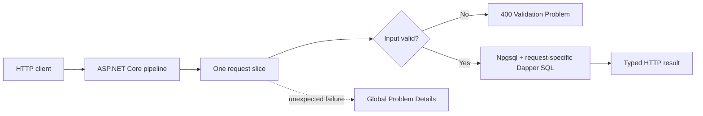

# Architecture

This reference follows Jimmy Bogard's definition of Vertical Slice Architecture: treat each
request as a distinct use case, group its concerns front-to-back, minimize coupling between slices,
and maximize cohesion inside a slice.

## The unit of architecture

A capability is not automatically a slice:

```text
Languages                         capability
├── ListLanguages.cs              query slice
├── GetLanguage.cs                query slice
├── CreateLanguage.cs             command slice
├── UpdateLanguage.cs             command slice
└── DeleteLanguage.cs             command slice
```

Every request file owns:

1. Route and OpenAPI metadata
2. Request-specific input and output records
3. A slice-local FluentValidation validator when the request has rules
4. Handler flow
5. Tailored parameterized SQL
6. Projection into the response
7. Expected failure translation

The feature registration file only composes the capability's routes.

## Request flow



There is no application-wide service or repository gate. A query can use a purpose-built join while
a command can use `INSERT ... RETURNING`. Each slice chooses the simplest pattern that fulfills its
request.

## Project structure

```text
src/symphony-test-1.Api/
├── Features/
│   ├── Languages/
│   │   ├── LanguagesFeature.cs
│   │   ├── ListLanguages.cs
│   │   ├── GetLanguage.cs
│   │   ├── CreateLanguage.cs
│   │   ├── UpdateLanguage.cs
│   │   └── DeleteLanguage.cs
│   ├── Greetings/
│   │   ├── GreetingsFeature.cs
│   │   ├── ListGreetings.cs
│   │   ├── GetGreeting.cs
│   │   ├── GetGreetingByLanguage.cs
│   │   ├── CreateGreeting.cs
│   │   ├── UpdateGreeting.cs
│   │   └── DeleteGreeting.cs
│   └── Health/
│       ├── HealthFeature.cs
│       └── GetHealth.cs
└── Program.cs

src/symphony-test-1.AppHost/
└── AppHost.cs                     Aspire resource graph and startup ordering

src/symphony-test-1.DatabaseMigrations/
└── Program.cs                     Versioned, checksum-verified SQL migration runner

src/symphony-test-1.ServiceDefaults/
└── Extensions.cs                  Telemetry, health, resilience, and discovery defaults
```

## Anatomy of a slice

`CreateLanguage.cs` contains nested `Request` and `Response` records, an internal
`RequestValidator : AbstractValidator<Request>`, a `Map` method, and the handler. The handler:

1. Receives `IValidator<Request>` from dependency injection and calls `ValidateAsync` before
   opening a connection.
2. Opens a connection from the shared `NpgsqlDataSource`.
3. Executes parameterized SQL with a cancellation-aware `CommandDefinition`.
4. Uses PostgreSQL `RETURNING` to produce the response atomically.
5. Maps only the expected unique constraint violation to `409 Conflict`.
6. Lets unexpected exceptions reach centralized exception handling.

Keeping these decisions together makes the use case understandable and changeable in one place.

## What is shared

Shared code is intentionally small:

| Shared concern | Why it is shared |
| --- | --- |
| Aspire Npgsql client integration | Connection pooling, health checks, and telemetry are platform mechanics |
| Global Problem Details | Unexpected failures need one safe response policy |
| OpenTelemetry logging | Exports structured `ILogger` events with active trace and span context |
| Aspire service defaults | Captures telemetry and supplies platform health and resilience |
| FluentValidation registration | Discovers internal validators while rules remain inside slices |
| Capability route registration | Composes slices without owning their behavior |

Database migrations remain centralized because the sample uses one relational schema. The AppHost
runs the migration project to completion before it starts the API. The runner serializes concurrent
attempts with a PostgreSQL advisory lock and rejects changes to an already-applied migration by
comparing its checksum. A larger modular system could own migrations per module without changing
the slice design.

## What is not shared

The project deliberately avoids:

- Resource-wide repositories
- Generic repositories
- Application-wide CRUD services
- Shared persistence entities used as API contracts
- One request/response model reused across unrelated operations
- Broad exception catching inside slices
- A mandatory handler dispatch library

Small mapping or validation duplication is acceptable when it prevents two requests from becoming
coupled. Extract a shared concept only when it has stable meaning beyond coincidentally similar
code.

## MediatR and CQRS

The read and write use cases naturally have different models and SQL, which provides practical
command/query separation. MediatR is not required to achieve this. This reference uses direct
Minimal API delegates so the request flow remains visible.

MediatR can be introduced when its dispatch or pipeline behavior solves a demonstrated problem. It
should not be added merely as an architectural badge.

## Validation and errors

- Command request rules use FluentValidation's strongly typed fluent API.
- Each validator is nested in its owning slice rather than placed in a parallel validation layer
  or a separate file.
- Validators are registered by assembly scanning, injected as `IValidator<Request>`, and invoked
  explicitly with the request cancellation token.
- Error property names are overridden where necessary to preserve lower-camel-case JSON contract
  keys such as `languageId` and `greetingText`.
- Invalid input returns `application/problem+json` validation details.
- Missing resources return `404 Not Found`.
- Language uniqueness violations return `409 Conflict`.
- Greeting foreign-key violations return a `400` validation problem on `languageId`.
- Unexpected exceptions are logged and rendered safely by global Problem Details.
- Health failures return `503` without exposing connection or exception details.

OpenAPI metadata on each slice declares the same result set implemented by the handler.
Each route also supplies a concise summary and a behavioral description. XML documentation on
slice-local request and response records describes their JSON fields in the generated schema.
Because those contracts intentionally share the nested names `Request` and `Response`, the
composition root prefixes OpenAPI schema reference IDs with the declaring slice name so every
contract remains distinct.

## Transactions and domain logic

The sample's commands each require one SQL statement, so they do not need explicit transactions.
When a use case requires multiple atomic writes, its slice should own the transaction boundary.

Start with a transaction script. If business rules become complex, refactor that slice toward the
appropriate domain model or service. Do not impose one domain pattern on every request.

## Testing aligned to architecture

```text
tests/unit/Features/             deterministic slice rules
tests/integration/Features/      every slice through HTTP and PostgreSQL
tests/e2e/Features/              workflows crossing slices
```

Integration tests are the primary proof because most slices coordinate HTTP binding, validation,
SQL, PostgreSQL constraints, and response mapping. Unit tests are reserved for deterministic logic;
they do not mock nonexistent service and repository layers.

The migration harness applies all ordered `V*.sql` files, so adding a migration does not require
editing test infrastructure.

## Adding a slice

1. Name the use case in command/query language, such as `SearchGreetings` or `ArchiveLanguage`.
2. Add one file under the owning capability.
3. Define only the contract that request needs.
4. Add a nested `RequestValidator` when needed and implement the simplest appropriate SQL.
5. Carry cancellation through every I/O call.
6. Return typed results and accurate OpenAPI metadata.
7. Register the slice in the capability feature file.
8. Add tests for success and relevant failure outcomes.
9. Update feature and API documentation.
10. Run formatting, build, all tests, and the dependency audit.

The repository skill at `.github/skills/build-vertical-slice/SKILL.md` gives agents the same
workflow.

## References

- [Jimmy Bogard: Vertical Slice Architecture](https://www.jimmybogard.com/vertical-slice-architecture/)
- [Jimmy Bogard: Contoso University sample](https://github.com/jbogard/ContosoUniversityDotNetCore)
- [FluentValidation with ASP.NET Core Minimal APIs](https://docs.fluentvalidation.net/en/latest/aspnet.html#minimal-apis)
- [SSW Vertical Slice Architecture validator example](https://github.com/SSWConsulting/SSW.VerticalSliceArchitecture/blob/main/src/WebApi/Features/Heroes/CreateHero/CreateHeroRequestValidator.cs)
